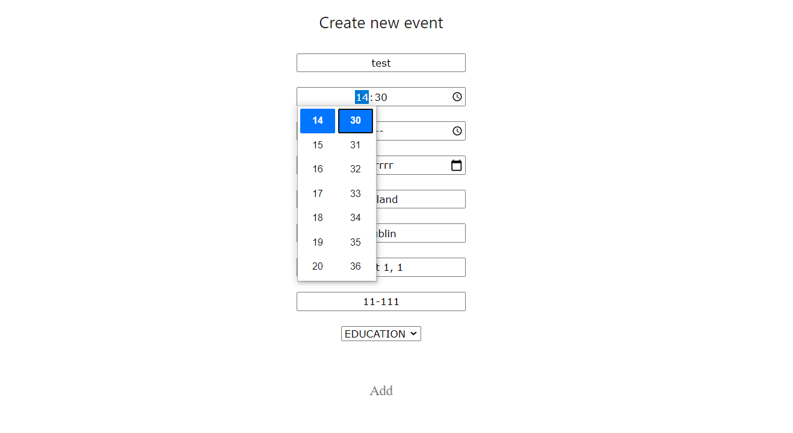

# Event recommendation system

The **event recommendation system** allows users to create a personal account. 
After successful registration user should activate created account by a link 
in the email message. 

In case of successful activation, after the first login user will be redirected 
to the panel where should choose interesting types of events, and some hashtags.

Application user could search events, register for an event, or become an event creator.
Some personal data can be edited by the user in a personal profile panel. 
Also, in this panel user can change selected preferences. Selected preferences 
will be used to propose events. 

Each event must contain basic data like ***topic, place, hashtags etc***.
 
Technologies used in this project:
  - Java 9
  - Spring Boot 2.3.0
  - Spring Boot Data JPA
  - Spring Boot Security
  - MySQL  
  - Freemarker 2.3.28
  - CSS
  - JavaScript

_For more, please, check the main [pom.xml](./pom.xml) file_

## Application screenshots 

1. Event creation panel 

2. Events calendar with filtering buttons

3. All not deleted, active events created by a user 

4. All available events for registration

5. Personal account panel with editable fields

